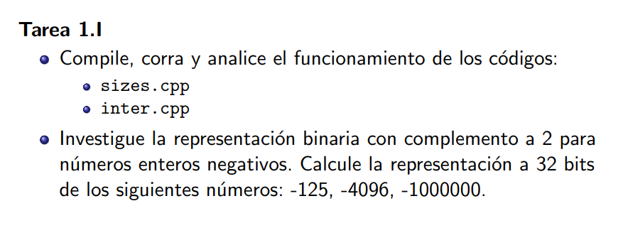
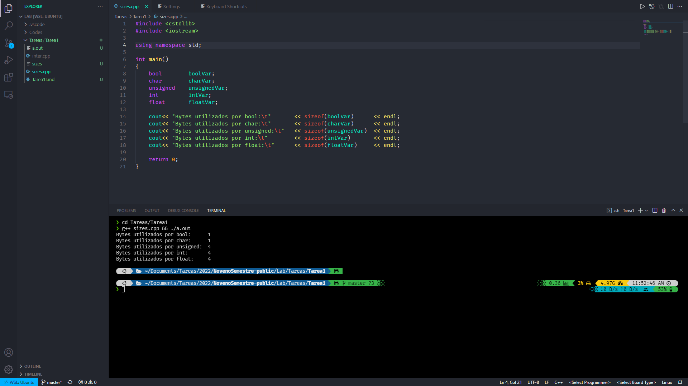
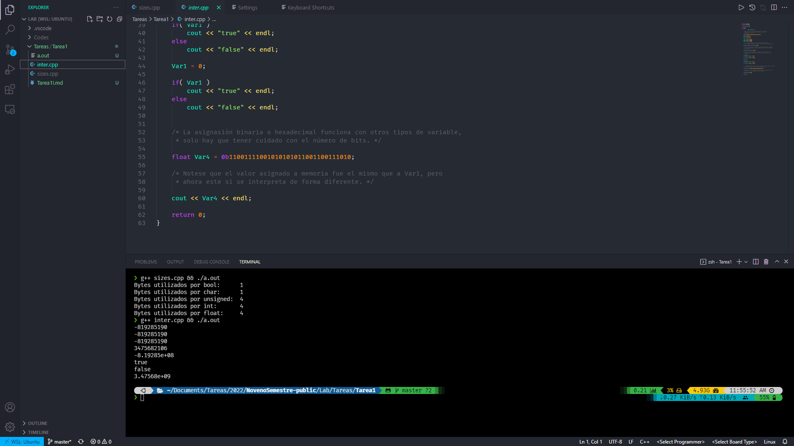

                                                                                  Jorge Alejandro Rodríguez Aldana

                                                                                                                       201804766

# Tarea 1.I.

---

## Compile, corra y analice el funcionamiento de:

### sizes.cpp

Como vimos en clase, este comando imprime los tamaños ocupados en memoria para cada tipo de variable.

### inter.cpp

En este código ocurren varias cosas:

* En las primeras 3 líneas:
  
  * El valor `-819285190` es asignado a una variable tipo entero de 3 formas distintas:
    
    * Notación binaria
    * Notación hexadecimal
    * Notación decimal

* En la línea 4, se imprime este mismo valor como variable tipo entero pero a su interpretación a complemento a 2.

* En la línea 5, se imprime el mismo valor pero en su notación de punto flotante.

* En la línea 6 y 7 se interpreta este mismo valor como tipo booleano, que se interpreta como verdadero para cualquier valor menos cero. Por lo que se imprime `true` al principio, y false después de asignarle a esta variable el valor cero.

* Finalmente se asigna el mismo valor en binario de esta variable a una variable tipo punto flotante, por lo que la interpretación cambia, ya que solo algunos datos del binario son tomados para el número en sí, y los otros son asignados la posición del punto decimal.

---

## Representación binaria con complemento a 2 para números enteros negativos:

Una forma útil de entender el complemento a dos de un número (que se me acaba de ocurrir así que es posible que no esté bien) es tomar el complemento como el inverso aditivo del número original, pero esta vez, el elemento neutro no es cero, si no es $2^n$ en base $2$ donde $n$ es la cantidad de bits utilizada para calcular el complemento.

Por ejemplo a $3$ bits tenemos:

$$
3+5 = 8 = 2^3\\
011_2+101_2=1000_2
$$

Por lo que $101_2$ es el complemento a $2$ de $011_2$ y viceversa.

Entonces podemos hacer una tabla de los números para $n$ bits y sus respectivos complementos:

| Número | Complemento |
|:------:|:-----------:|
| 000    | 1000        |
| 001    | 111         |
| 010    | 110         |
| 011    | 101         |
| 100    | 100         |
| 101    | 011         |
| 110    | 010         |
| 111    | 001         |

Es fácil demostrar que el complemento a $2$ de cualquier número puede obtenerse al invertir los bits y sumarle $1$:

---

**Demostración:**

Para un número $A$ de $n$ bits $b_i$ tenemos:

$$
A=b_nb_{n-1}\cdots b_3b_2b_1
$$

Invertir los bits $b_i\rightarrow \bar{b}_i$ nos devuelve un número $B$:

$$
B = \bar{b}_n\bar{b}_{n-1}\cdots\bar{b}_3\bar{b}_2\bar{b}_1
$$

***Nota:*** *los subíndices indican la posición del byte, y comienzan a contarse de derecha a izquierda.*

Puesto que $b_i$ y $\bar{b}_i$ son necesariamente bits opuestos, es decir, no pueden ser ambos $0$ o ambos $1$, entonces tenemos que $b_i+\bar{b}_i=1$:

$$
A+B=b_nb_{n-1}\cdots b_3b_2b_1+\bar{b}_n\bar{b}_{n-1}\cdots\bar{b}_3\bar{b}_2\bar{b}_1\\
A+B = 1_n1_{n-1}\cdots1_31_21_1
$$

Finalmente, si sumamos $1$ a esta expresión:

$$
(A+B)+1=1_n\cdots1_21_1+0_n0_{n-1}\cdots 0_30_21_1\\
(A+B)+1=1_{n+1}0_n0_{n-1}\cdots 0_30_20_1
$$

Por asociatividad:

$$
A+(B+1)=1_{n+1}0_n\cdots0_20_1=2^n
$$

Definimos entonces $\bar{A}=B+1$ como el complemento a $2$ de $A$. 

---

Ahora que entendemos que es el complemento a $2$ de un número pasamos a definir con este los números negativos representados por bytes. Revisemos de nuevo la tabla, pero esta vez, escribiremos las representaciones enteras, y diremos que el complemento a 2 es el negativo del entero en cuestión.

| Entero | Base 2 | Complemento a 2 | Entero negativo |
|:------:|:------:|:---------------:|:---------------:|
| 0      | 000    | 1000            | 0               |
| 1      | 001    | 111             | -1              |
| 2      | 010    | 110             | -2              |
| 3      | 011    | 101             | -3              |
| 4      | 100    | 100             | -4              |
| 5      | 101    | 011             | -5              |
| 6      | 110    | 010             | -6              |
| 7      | 111    | 001             | -7              |

Esto tiene sentido, sin embargo hay un problema: Una misma representación binaria hace referencia a dos números enteros, uno positivo y uno negativo. Esto claramente no puede pasar. Pero la solución es sencilla, partimos la tabla a la mitad y aunque reducimos a la mitad la cantidad de enteros que se pueden representar, esta vez ya no habrá duplicados:

| Entero | Base 2 | Complemento a 2 | Entero negativo |
| ------ | ------ | --------------- | --------------- |
| 0      | 000    | 1000            | 0               |
| 1      | 001    | 111             | -1              |
| 2      | 010    | 110             | -2              |
| 3      | 011    | 101             | -3              |

Ahora todas las combinaciones de bits tienen solamente un posible valor entero. La única combinación que no lo tiene es la de $100$, que por convención representa al $-4$. Esta convención aplica en la generalización a más bits, ya que siempre la representación de en medio: $1_n0_{n-1}\cdots0_20_1$ para $n$ bits será siempre igual a su complemento a 2 además de ser la posición en donde la lista se corta por la mitad, por convención se toma como $-2^{n-1}$.

## Representación a 32 bits de:

* -125:
  * 00110111 00110101 00111000 00110001 00111001 00111000 00111000 00110011 00110111
  * 37 35 38 31 39 38 38 33 37
* -4096:
  * 00110111 00110101 00111000 00110011 00111001 00110100 00111001 00110011 00110111 00100000 00111001 00110000 00110101 00111001 00110110 00111001 00110110 00110110 00110100
  * 37 35 38 33 39 34 39 33 37 20 39 30 35 39 36 39 36 36 34
* -1000000:
  * 00110111 00110101 00111000 00110001 00111001 00111000 00110011 00110010 00110000 00100000 00111000 00110000 00111000 00110100 00110110 00110100 00110100 00110011 00110010
  * 37 35 38 31 39 38 33 32 30 20 38 30 38 34 36 34 34 33 32
